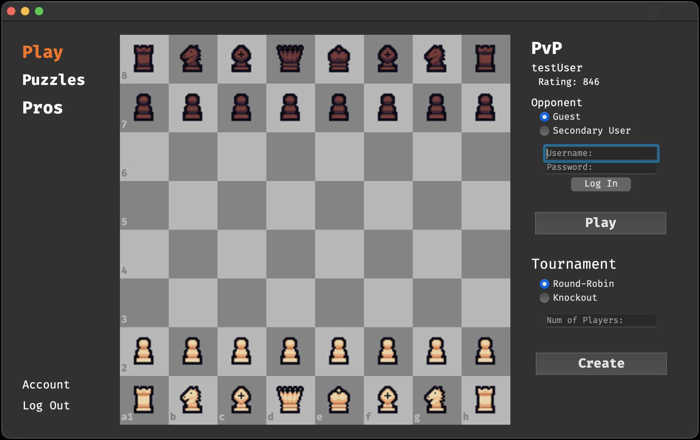
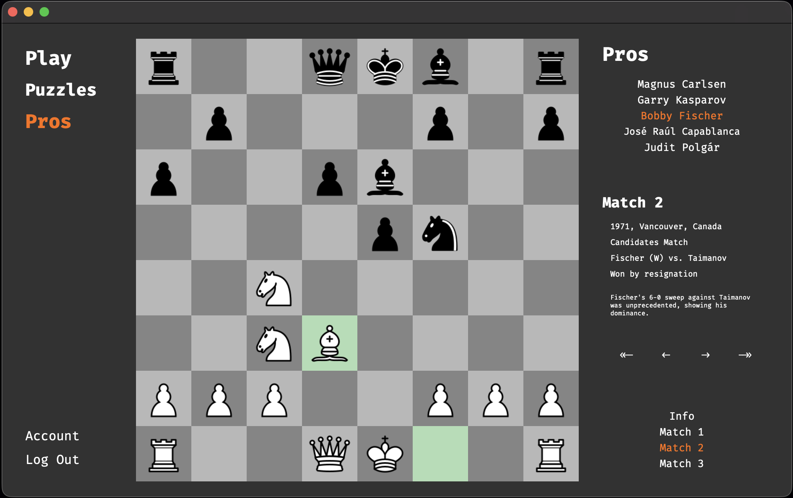
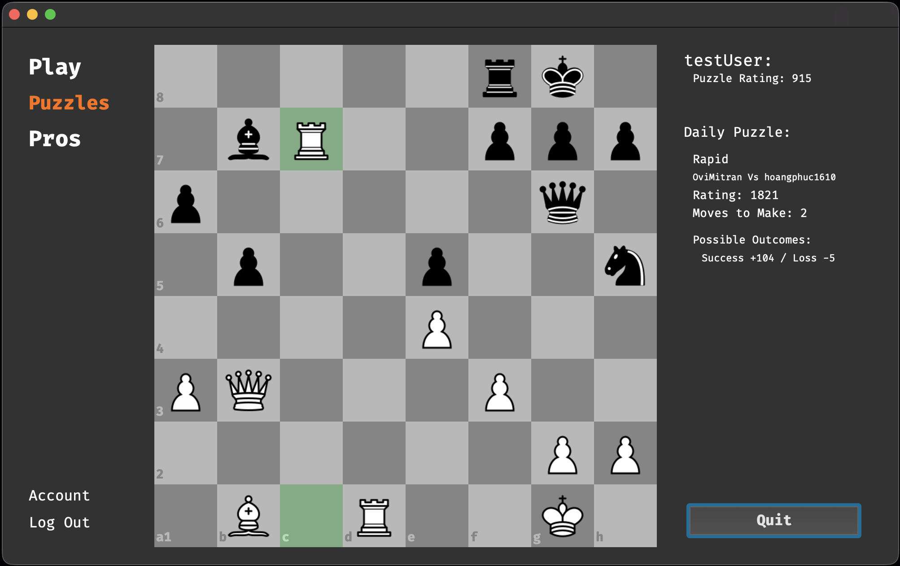
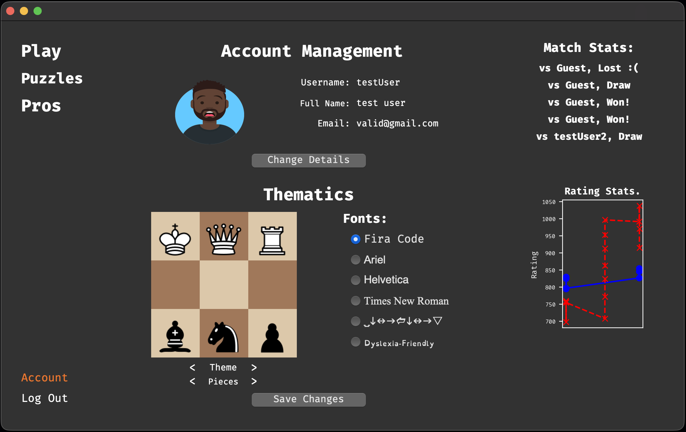

# Chess Teacher
This project was developed for my non-exam assessment (NEA) for my computer science a-level.
It was built from scratch using PyQt5 for the frontend GUI along with a few puzzle APIs, with the subscription for one now having ran out.

